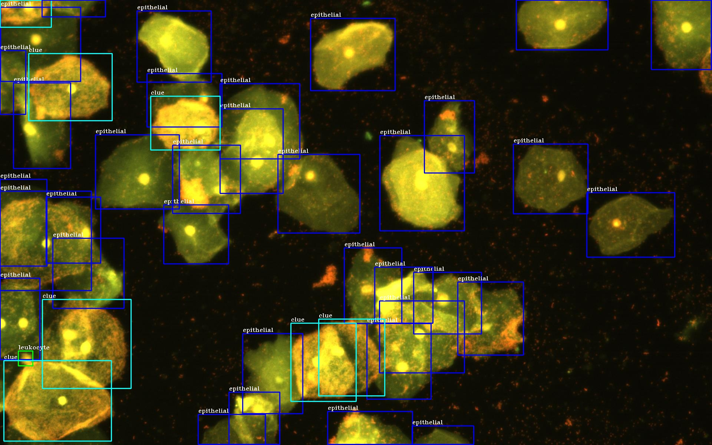

<!--
 * @Author: ss
 * @Date: 2024-05-21 17:22:45
 * @LastEditTime: 2024-05-21 17:31:47
 * @Description: 
 * @FilePath: /Multiple-fluorescent-leucorrhea-microscopy-dataset/README.md
-->
# Multiple-fluorescent-leucorrhea-microscopy-dataset

Our study provides a novel benchmark dataset for multiple fluorescent leucorrhea detection, intending to advance gynecological outpatient and obstetric prenatal examinations. Our dataset comprises 6,698 images and 343,150 annotations of 8 cells and tangible objects for detection and identification. These include epithelial cells, clue cells, hyphae, red blood cells, trichomonas, lactobacillus, leukocytes, and candida.  
Moreover, we can achieve excellent results by applying the algorithm and dataset to the actual hardware known as the [fluorescence staining platform]((http://www.uni-medica.com/)), which is developed by Shenzhen United Medical Technology Co., Ltd.

## Dataset examples

| Images                                                       | Instances                                                    |
| ------------------------------------------------------------ | ------------------------------------------------------------ |
|  |  |
|  |  |
|  |  |

## Link

 Our dataset is labeled using the [YOLO](https://docs.ultralytics.com/yolov5/tutorials/train_custom_data/#12-create-labels) format and will be made publicly available through the following links.  

| Cloud         |            |
| ------------- | ---------- |
| Google Drive  | [google](https://drive.google.com/drive/folders/1FZ8T-VGPYNnBX_KFS1AhgY9ihuJe2ZGG?usp=drive_link) |
| Baidu Netdisk | [baidu](https://pan.baidu.com/s/1kkDcIGUQI4txU4ma05j6LQ?pwd=l78j)  |

 **Note**: If our paper has been accepted, we will make the labels publicly available. 

## License

Our dataset implementation is released under the MIT License, which can be found at   https://opensource.org/licenses/MIT. 

## Contact Information

 If you have any questions, please contact me.